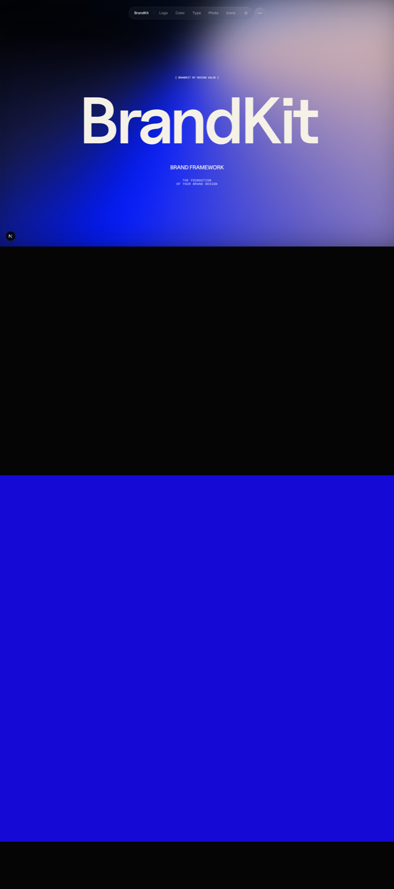
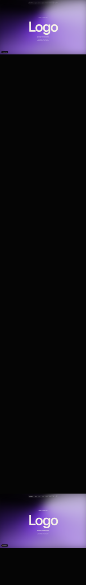
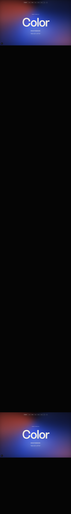
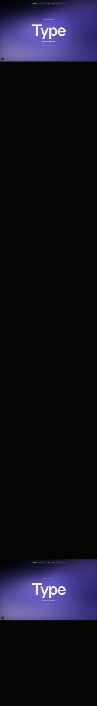
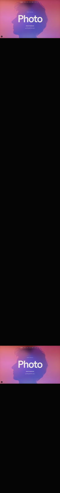
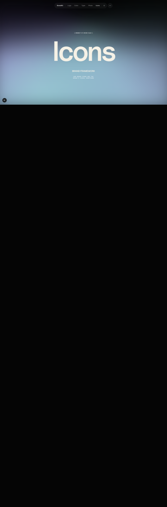

# BrandKit

**A living home for your brand.**  
**Open source at its core.**  
**Built with React, Next.js, and TypeScript. Designed through vibe coding.**

---

## Overview

BrandKit brings your entire brand system into one place—clear, structured, and always up to date.

No scattered files. No outdated PDFs. No confusion.

Just a single, elegant interface where your brand lives and evolves.

Fully open source—so you’re never locked in, and always in control.

---

## The idea

Your brand isn’t static.  
Your brand system shouldn’t be either.

BrandKit transforms guidelines into a living experience—something your team uses, not just stores.

And because it’s open source, it’s not just a product—it’s a foundation you can shape, extend, and truly own.

---

## Designed for clarity

Every element has its place.

Logos. Colors. Typography. Imagery. Icons.

Organized with intention. Presented without noise. So anyone—designer, developer, or partner—can understand your brand instantly.

---

## What sets it apart

- **Open by default** — Fully open source. Transparent, customizable, and built to evolve with you.

- **Built for modern teams** — Powered by React, Next.js, and TypeScript for speed, reliability, and scale.

- **Vibe-coded by design** — Crafted to feel intuitive, adaptable, and effortless to extend.

- **Always current** — Your brand updates in real time. No versions. No confusion.

- **One link. Total alignment.** — Share your brand once. Everyone sees the same source of truth.

- **Precision across screens** — Carefully designed for desktop, tablet, and mobile—with balance, spacing, and hierarchy that feels right everywhere.

---

## Who it’s for

For teams that want control—not constraints.  
For builders who value clarity and ownership.  
For companies that are growing—and need their brand to keep up.

---

## Structure

- Home  
- Logo  
- Color  
- Typography  
- Imagery  
- Icons  

---

## Screenshots

Full-page captures from a local run (desktop width). The **Imagery** section in the app lives at `/photo`.

### Home



### Logo



### Color



### Typography



### Imagery



### Icons



---

## Run locally

From the project root:

```bash
pnpm install
pnpm dev
```

Open the URL printed in the terminal (by default **http://127.0.0.1:3000**). The dev server binds to `127.0.0.1` so it behaves consistently if `localhost` resolves oddly on your machine.

If the port is already in use, Next will try the next free port (for example **3001**); use whatever URL the log shows.

**“Unable to acquire lock … is another instance of next dev running?”**  
Stop every other `pnpm dev` / `npm run dev` tab or window, wait a second, then start again. Only one dev server can use this project’s `.next` folder at a time.

```bash
npm install
npm run dev
```

---

## License

This project is released under the [MIT License](LICENSE).

---

Crafted with ❤️ [Design Value](https://designvalue.co)
